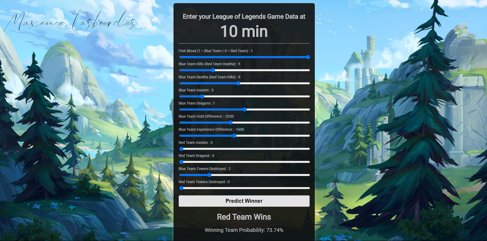

<div align="center">
  <h1>League of Legends Match Outcome Prediction</h1>
  
</div>

# Introduction

This project employs a predictive model to forecast the outcome (victory or defeat) of a League of Legends match (Blue Team Vs Red Team) using data gathered from the first 10 minutes of gameplay. The model is deployed using a Flask server, allowing you to select your preferred input parameters.

<div align="center">
  
</div>

# Installation

We advise to use a dedicated environnement (conda, mamba, whatever you like) to install the librairies.

Clone repo :
```
git clone https://github.com/MaxLSB/LoL-Game-Win-Prediction.git
```

Install the requirements for the app:
```
pip install -r requirements.txt
```

Scripts must be executed from the root folder of the project, be careful about the paths!

Launching the server:
```
python app.py
```

Connect to the server:
```
http://127.0.0.1:5000/
```
<h2> Change the values of the features as you please and predict the game outcome! </h2>
